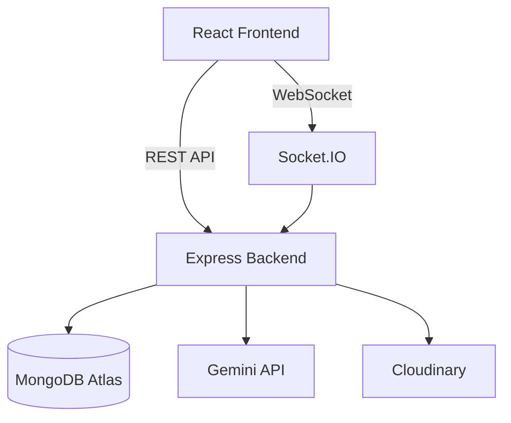
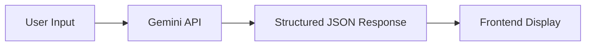

<div align="center">
  

# 🚀 HackCentral

**HackCentral is a full-stack MERN platform that helps students discover hackathons, coding contests, workshops, and conferences while providing AI-powered project assistance and real-time event communication.**

  <br />

[](#)
[](#)
[](#)
[](#)
[](#)
[](#)
[](#)
[](#)

</div>

<br />

## 🌍 Live Demo

- **Live Website:** [https://hackcentral.me](https://hackcentral.me)
- **API Docs:** [API Documentation](API_DOCS.md)

[](https://www.youtube.com/watch?v=SghLIZvvfb0)

---

## 📸 Screenshots

.png>)
.png>)
.png>)
.png>)
.png>)
.png>)
.png>)
.png>)


---

## ❓ Problem Statement

Students often rely on multiple platforms to discover hackathons, coding contests, conferences, and learning resources. HackCentral centralizes these opportunities into a single platform while enhancing the experience with AI-powered project assistance and real-time communication.

---

## ✨ Features

### User

- Authentication (Email & Google OAuth)
- Discover Events (Hackathons, Workshops, Conferences)
- Search & Filters
- Bookmark Events
- Register for Events
- Dashboard Analytics
- Resource Hub

### Organizer

- Organizer Dashboard
- Submit Events
- Analytics
- Live Announcements

### AI

- Project Evaluator (Gemini API)
- Pitch Deck Generator

### Real-Time

- Live participant count
- Event announcements
- Organizer notifications

---

## 🛠️ Tech Stack

| Category           | Technologies                             |
| ------------------ | ---------------------------------------- |
| **Frontend**       | React, Vite, Tailwind CSS, Redux Toolkit |
| **Backend**        | Node.js, Express.js                      |
| **Database**       | MongoDB Atlas, Mongoose                  |
| **Authentication** | JWT, OAuth (Google/Firebase)             |
| **AI**             | Gemini API                               |
| **Real-Time**      | Socket.IO                                |
| **Deployment**     | Docker, AWS EC2, Nginx, Let's Encrypt    |
| **Storage**        | Cloudinary                               |

---

## 🏗️ Architecture



---

## 📂 Folder Structure

```text
HackCentral/
├── frontend/             # React + Vite Client
├── backend/              # Node.js + Express Server
│   ├── controllers/      # Route logic
│   ├── models/           # Mongoose schemas
│   ├── routes/           # Express routes
│   ├── middlewares/      # Auth & Error handling
│   ├── socket/           # Socket.IO configuration
│   └── services/         # External APIs (Email, Gemini)
├── docker-compose.yml    # Docker configuration
└── README.md
```

---

## 🗄️ Database Design

The MongoDB database consists of the following primary collections:

- `User`
- `Event`
- `Resource`
- `Notification`
- `ActivityLog`

---

## 💻 Installation

1. **Clone the repository**

   ```bash
   git clone https://github.com/devashishhaldar2006/HackCentral.git
   cd HackCentral
   ```

2. **Backend Setup**

   ```bash
   cd backend
   npm install
   cp .env.example .env
   npm run dev
   ```

3. **Frontend Setup**

   ```bash
   cd frontend
   npm install
   npm run dev
   ```

4. **Running with Docker**
   ```bash
   docker compose up --build -d
   ```

---

## 🔐 Environment Variables

Create a `.env` file in the `backend` directory. Reference `.env.example` for the required keys.

**`.env.example`**

```env
PORT=7777
MONGO_URI=your_mongodb_connection_string
JWT_SECRET=your_jwt_secret
FRONTEND_URL=http://localhost:5173

# Firebase/Google OAuth
FIREBASE_PROJECT_ID=
FIREBASE_PRIVATE_KEY=
FIREBASE_CLIENT_EMAIL=

# Email (Nodemailer)
EMAIL_USER=
EMAIL_PASS=

# AI & Storage
GEMINI_API_KEY=
CLOUDINARY_CLOUD_NAME=
CLOUDINARY_API_KEY=
CLOUDINARY_API_SECRET=
```

---

## 🐳 Docker

HackCentral is fully containerized for consistent environments across development and production.

To run the full stack:

```bash
docker compose up --build -d
```

This automatically builds and orchestrates:

- **Frontend Container** (Nginx serving React)
- **Backend Container** (Node.js API)

---

## 🔌 API Overview

The REST API is organized into the following primary modules:

- `/api/auth` - Authentication & Registration
- `/api/events` - Event CRUD & Discovery
- `/api/profile` - User Profile & Bookmarks
- `/api/dashboard` - Analytics & Metrics
- `/api/resources` - Learning Materials
- `/api/project-lab` - AI Evaluator & Pitch Deck
- `/api/organizer` - Event Management

---

## ⚡ Socket.IO Events

| Event                | Description               |
| -------------------- | ------------------------- |
| `join-event`         | Join event room           |
| `leave-event`        | Leave event room          |
| `participant-update` | Live participant count    |
| `announcement`       | Organizer announcement    |
| `notification`       | Registration notification |

---

## 🤖 AI Workflow



---

## 🚢 Deployment

HackCentral is built for production scalability:

- **Containerization:** Docker
- **Hosting:** AWS EC2
- **Database:** MongoDB Atlas
- **CI/CD:** Automated deployments via GitHub Actions

---

## 🔮 Future Enhancements

- Admin Panel for platform moderation
- Event Recommendation Engine
- Certificate Generation
- Calendar Integration
- Email Reminders

---

## 👨‍💻 Contributors

- **Devashish Haldar** - Lead Developer

---

## 📝 License

[MIT License](LICENSE)

---

## 🙏 Acknowledgements

- Gemini API
- MongoDB
- Socket.IO
- Cloudinary
- Docker
- AWS

---

## 📫 Contact

- **GitHub:** [@devashishhaldar2006](https://github.com/devashishhaldar2006)
- **LinkedIn:** [Devashish Haldar](https://www.linkedin.com/in/devashish-haldar)
- **Email:** hackcentralofficial@gmail.com
